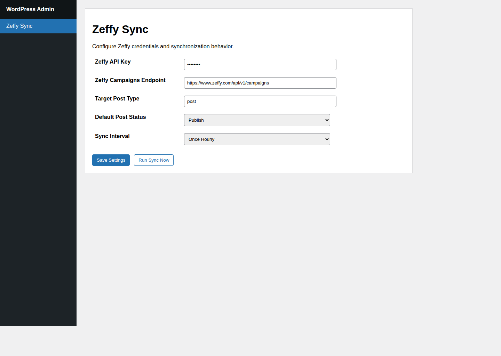

# zeffy-sync

WordPress plugin that syncs Zeffy campaigns to WordPress posts/events.

## Zeffy source API

- `GET https://api.zeffy.com/api/v1/campaigns`

## WordPress UI setup

After activation, use the **Zeffy Sync** item in the WordPress admin sidebar.



The settings page includes pre-filled defaults that you can change:

- **Zeffy API Key** (credential)
- **Zeffy Campaigns Endpoint** (default: `https://api.zeffy.com/api/v1/campaigns`)
- **Target Post Type** (default: `post`)
- **Default Post Status** (default: `publish`)
- **Sync Interval** (default: `hourly`)
- **Campaigns to Import** (Event, Donation, Membership)

You can also trigger a manual run with **Run Sync Now**.

## Behavior

- Schedules a recurring sync on activation using the selected interval.
- Pulls Zeffy events (including nested campaign events when present) and normalizes key fields (`event_id/id/campaign_id`, `event_name/name/title`, `details/description/summary`, `status`).
- Finds existing content via `_zeffy_campaign_id` post meta.
- Creates a post for each new event; updates the matching post when the event already exists.
- Stores Zeffy campaign linkage in `_zeffy_campaign_id`.
- Supports category-based import filtering using Zeffy `category` values:
  - `Event` → Event
  - `DonationForm` → Donation
  - `MembershipV2` → Membership
- Uses campaign `title` for post title, `description` for post body, `url` as `zeffy_url` meta, and `banner_url` as the featured image.
- Applies matching WordPress category and post tag terms for Event, Donation, and Membership campaigns.

## WP-CLI

```bash
wp zeffy-sync run
```

## CI zip artifact

GitHub Actions builds a plugin zip artifact on each push and pull request.

1. Open the workflow run for **Build plugin zip**.
2. Download artifact **zeffy-sync-plugin**.
3. Install in WordPress via **Plugins → Add New → Upload Plugin**.

## Auto-update flow

- On pushes to `main`, CI publishes a new GitHub Release with a versioned `zeffy-sync.zip`.
- The plugin checks the latest GitHub release and reports updates to WordPress using `Update URI`.
- Enable auto-updates in WordPress for **Zeffy Sync** to receive each new CI build automatically.
